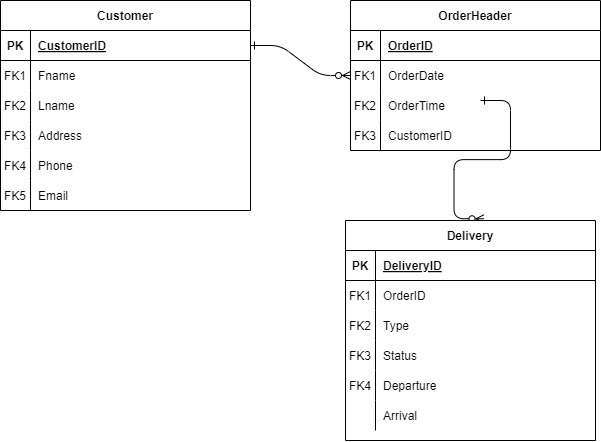

- Discuss the basic architecture of a database system.
- Components to cover:
    - Database Engine
    - Query Processor
    - Storage Manager
    - Transaction Manager

### Database Engine:
A Database Engine is the software that a Database Management System uses for editing and interacting with the data in a database.

### Query Processor:
SQL Requests are processed by a **Query Processor**. This subcomponent is found in the data server that hosts the database

### Storage Manager:
A storage manager is like an interface that connects the stored data and the queries & requests that are received

### Transaction Manager:
A Transaction Manager's main job is to make sure data is never lost. It uses checkpoints, transaction logs, and many more techniques in order to ensure that if a system or data server crashed, no data would be lost.

---

- Explain the fundamental operations of relational algebra:
   - Selection (σ)
   - Projection (π)
   - Union (∪)
   - Set Difference (−)
   - Cartesian Product (×)
   - Rename (ρ)

### Selection (σ)
Selection (σ) is sort of like a search method. It searches for rows that fit a given condition

### Projection (π)
Gets columns from table

### Union (∪)
As the name suggests, Union (∪) combines results of 2 queries (and removes duplicates)

### Set Difference (−)
Gets rows from first query which don't exist in second

### Cartesian Product (×)
Combines the rows of 2 tables (1:1)

### Rename (ρ)
Self-Explanatory, Renames attributes

#### Example:
> Enterprise company must keep costs down, so it might combine many tables using the Cartesian Product (×) in order to save on processing power and other costs.

---

- Explain the components of an Entity-Relationship (ER) model:
   - Entities
   - Attributes
   - Relationships

1. ### Entities
Entities are usually real objects and concepts (e.g. "Student", "Course")

2. ### Attributes
Attributes describe an entity (e.g. "Student ID", "Course Name")

3. ### Relationships
Relationships are the associations between different entities (e.g. "Student enrolls in Course")

- Use online modelling software (e.g., draw.io, Lucidchart) to create an ER model for a sample database.

## ERD Diagram:

---

- Explain the purpose of normalisation in database design.
- Discuss the normal forms (1NF, 2NF, 3NF, BCNF).

### Purpose: 
Organize data to minimize redundancy and dependency.

### Normal Forms:
- **1NF**: Eliminate repeating groups in rows.
- **2NF**: Ensure non-key attributes depend on the whole key.
- **3NF**: Eliminate transitive dependencies between non-key attributes.
- **BCNF**: Ensures all determinants are candidate keys.

- Provide examples of how to normalise a database schema to eliminate redundancy and improve data integrity.

### Initial Schema:

- **Books** (BookID, Title, Author, Publisher, Year_published, Category)

### Normalization Steps:

1. **First Normal Form (1NF):**
   - Break down multi-valued attributes.
   - Example: Split **Books** into separate tables for **Books** (BookID, Title, PublisherID, Year_published, Category) and **Authors** (AuthorID, AuthorName).

2. **Second Normal Form (2NF):**
   - Remove partial dependencies.
   - Example: If **Books** has a composite key (BookID, Author), separate into **Books** (BookID, Title, PublisherID, Year_published, Category) and **BookAuthors** (BookID, AuthorID).

3. **Third Normal Form (3NF):**
   - Eliminate transitive dependencies.
   - Example: Ensure attributes depend only on the primary key.
   - Split **Books** further if necessary, ensuring each table has non-transitive dependencies.

### Resulting Normalized Schema:

- **Books** (BookID, Title, PublisherID, Year_published, Category)
- **Authors** (AuthorID, AuthorName)
- **Publishers** (PublisherID, PublisherName, PublisherAddress)
- **BookAuthors** (BookID, AuthorID)

---